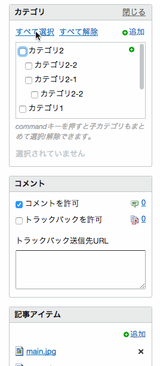

# カテゴリの複数選択を可能にするMovable Typeプラグイン

このプラグインは、記事の編集画面において、カテゴリの複数同時選択を用意に行うため、開発されました。

カテゴリ選択ウィジェットの上部に「すべて選択」「すべて選択解除」が表示されます。これらを選択すると、子孫カテゴリに至るまで、すべてのカテゴリを選択、または選択解除の状態にします。

カテゴリツリーにおいて、一部のツリーを選択するには、Ctrlキー(Windowsの場合。Macの場合はcommandキー)を押しながら親カテゴリを選択します。

# License

MITライセンスに基づいて公開します。